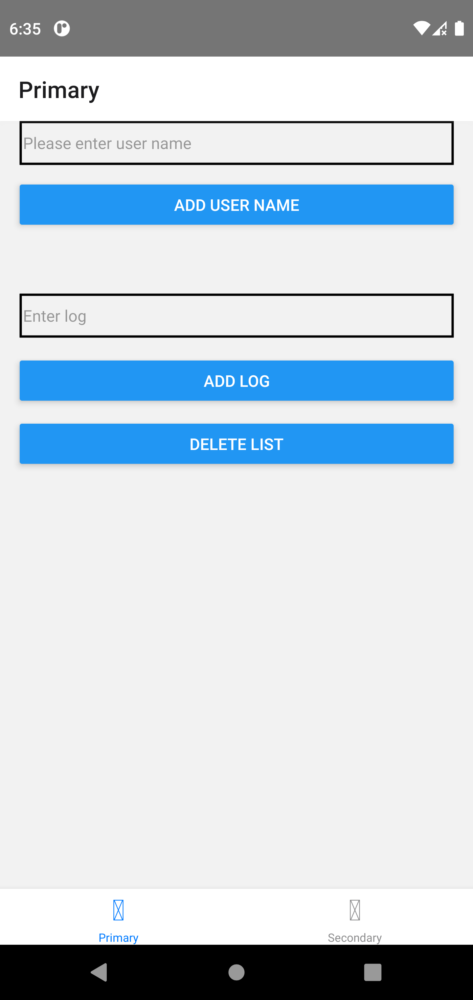
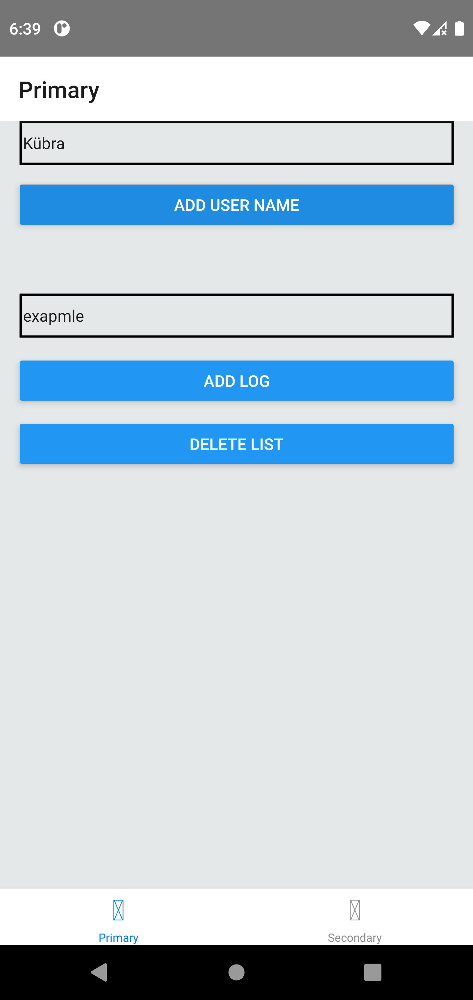
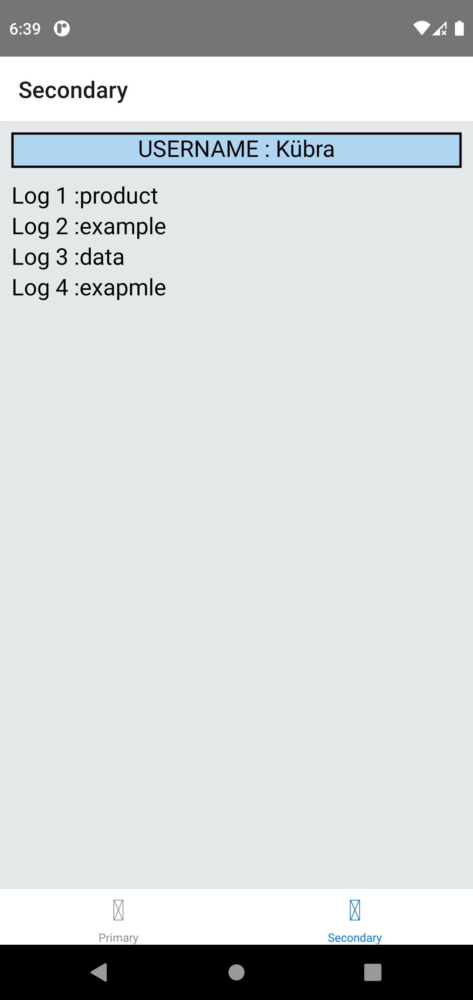

# React-Native-Redux-Practice
 
[Patika.dev](https://app.patika.dev/) Project assignment I developed to reinforce what I learned in React Native trainings.

## Features
- username can be added and updated
- new logs can added to the log list with add log button 
- the logs listed on Secondary page are cleaned with delete list button
- the logs added secondary page listed with index number
- Redux state management used

## Özellikler
- Username eklenebilir ve güncellenebilir.
- Add log butonu ile log listesine yeni loglar eklenir.
- delete list butonu ile Secondary sayfasında listelenen loglar temizlenir.
- Secondary sayfasında eklenen loglar index numarası ile birlikte listelenir.
- Redux state managament kullanıldı 

## Images




## Installation
Clone this repository on your local machine.

```
git clone https://github.com/kubrasambur/React-Native-Redux-Practice.git
```

## Usage
To use it after cloning the project:
```
cd React-Native-Redux-Practice
cd .
```
Run the following commands in the project folder to install the project dependencies.

```
npm init
npm install
```
These instructions will get a copy of the project up and running on your local machine for development and testing purposes.

## To Run the Application
In the project directory you can run:

```
npx react-native run-android
```
## For More Information
You can review the [React Native](https://reactnative.dev/) documentation. 
